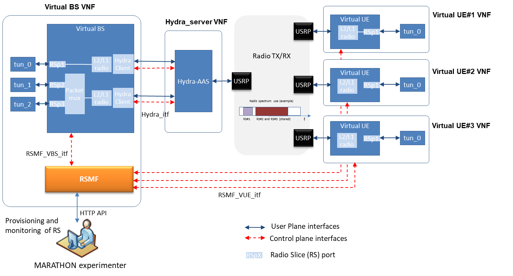
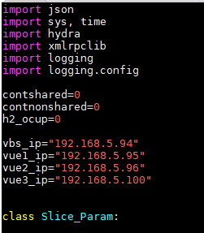
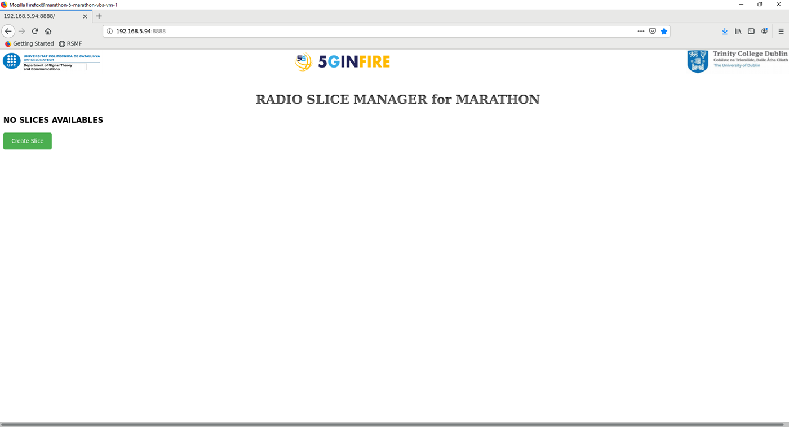

# RSMF (Radio Slice Management Function)
The Radio Slice Management Function (RSMF) is the new component developed in Marathon to carry out the lifecycle management of the Radio Slices (RSs).

Note that to use the RSMF you must have all the hydra components of the Marathon experiment running (details in [https://github.com/maiconkist/gr-hydra/tree/marathon](https://github.com/maiconkist/gr-hydra/tree/marathon)). That is the hydra_server, the VBS, three VUEs. The Marathon architecture is:

 

The RSMF final version allows to create up to three radio slices.

You can use that code in two ways: 
1. Manual
2. Assisted by ansible

In both cases, before starting the RSMF you must run the hydra components (hydra_server, hydra_vr1_rx, hydra_vr2_rx, hydra_vr3_rx and hydra_client_2tx_rx).

Then you must edit the file slice.py and change the IPaddresses of the machines running the VBS, and VUEs.
In that version you change them at top: 



Now you can run the RSMF:


```
sudo python rsmf.py
```

Open a web browser and go to:

```
*IP_machine*:8888
```

And start managing from the RSMF homepage. 


