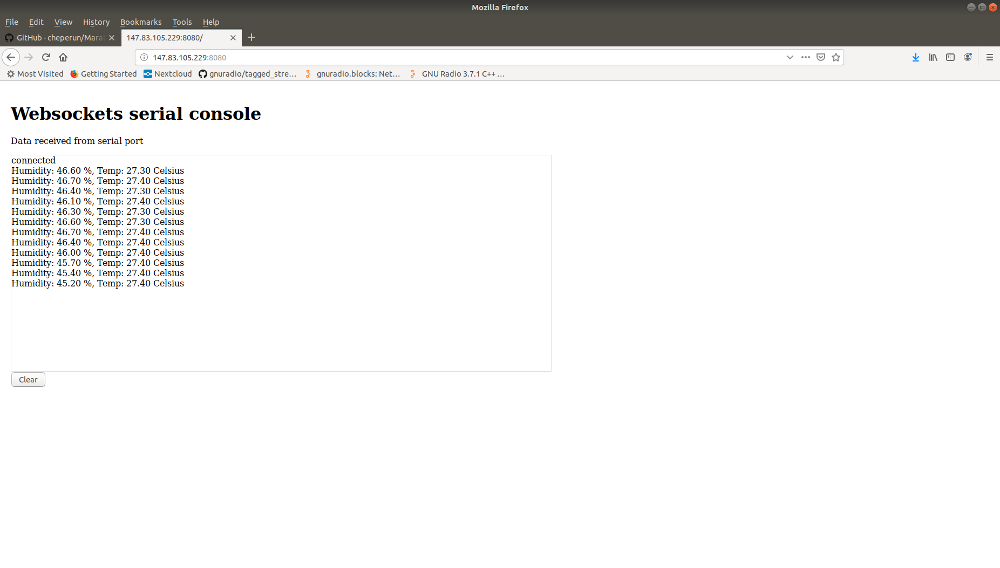

# Sensor monitoring application
This code allows to collect temperature and humidity data with a DHT22 sensor and an ARDUINO UNO board, and to display the data remotely in a web browser.

First, you must connect the sensor to PIN 4, or change the code accordingly, and then the "DHT22.ino" code must be upload to the Arduino board using the open-source Arduino Software (IDE) [Arduino IDE](https://www.arduino.cc/en/main/software).

Second to allow the remote visualization, the IP address of the machine where the Arduino is connected must be configured at javascript file "main.js" (replace *localhost* at line 6).

Third execute:

```
sudo python server.py
```

Fourth, from another machine, open a web browser and go to:

```
*IP_sensor_machine*:8080
```

EXAMPLE:
If you have the DHT22 sensor & Arduino board at PC 147.83.105.229, you must go to 147.83.105.229:8080 and you get the following result:


